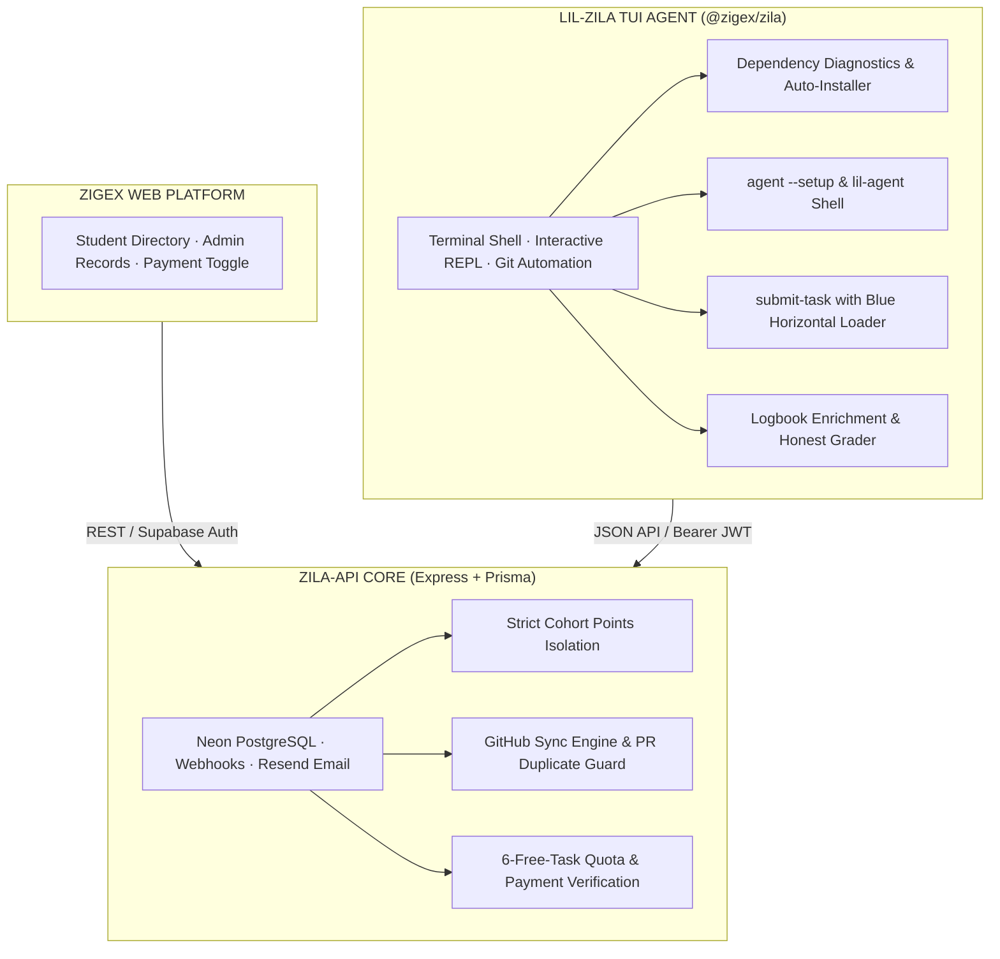

# Zila & Lil-Zila — Terminal Autonomous Agent & Internship Ecosystem

> **Zila (`@zigex/zila`)** is an agentic, retro-styled terminal workspace tool that governs the entire student internship and engineering training lifecycle — from dependency diagnostics and automated setup to autonomous GitHub PR task evaluation, contributor logbook enrichment, cohort leaderboard gamification, and compliance billing.

---

## Table of Contents

1. [Project Overview & Core Mission](#1-project-overview--core-mission)
2. [End-to-End System Architecture](#2-end-to-end-system-architecture)
3. [Implemented & Shipped Features](#3-implemented--shipped-features)
   - 3.1 [Cohort Binding & Dynamic Prompt (`zila select`)](#31-cohort-binding--dynamic-prompt-zila-select)
   - 3.2 [Cohort-Isolated Gamification Leaderboard](#32-cohort-isolated-gamification-leaderboard)
   - 3.3 [Automated PR Dispatcher & Blue Horizontal Loader](#33-automated-pr-dispatcher--blue-horizontal-loader)
   - 3.4 [GitHub Sync Engine & Duplicate Guard](#34-github-sync-engine--duplicate-guard)
   - 3.5 [Daily PR Quota Management (`zila quota`)](#35-daily-pr-quota-management-zila-quota)
   - 3.6 [Resend Transactional Email Dispatcher](#36-resend-transactional-email-dispatcher)
4. [Student Setup & AI Agent Workflow](#4-student-setup--ai-agent-workflow)
   - 4.1 [Dependency Diagnostics (`zila init` / `zila-init`)](#41-dependency-diagnostics-zila-init--zila-init)
   - 4.2 [Automated Package Resolution (`--all`, `--node`, `--python`, `--git`)](#42-automated-package-resolution---all---node---python---git)
   - 4.3 [Autonomous AI Setup Wizard (`agent --setup`)](#43-autonomous-ai-setup-wizard-agent---setup)
   - 4.4 [Interactive Claude Code-Style Shell (`lil-agent`)](#44-interactive-claude-code-style-shell-lil-agent)
5. [Autonomous Task Submission & Integrity Review](#5-autonomous-task-submission--integrity-review)
   - 5.1 [Supervisor Comment Instruction Parsing](#51-supervisor-comment-instruction-parsing)
   - 5.2 [Semantic Diff Truth Verification](#52-semantic-diff-truth-verification)
   - 5.3 [Automated Contributor Logbook Enrichment](#53-automated-contributor-logbook-enrichment)
   - 5.4 [Honest Rubric Marking (0.0 – 1.0)](#54-honest-rubric-marking-00--10)
6. [Business Model, Quota Gates & Penalty Distribution](#6-business-model-quota-gates--penalty-distribution)
   - 6.1 [Admin Payment Toggle on Zigex-App](#61-admin-payment-toggle-on-zigex-app)
   - 6.2 [6-Free-Task Tier Policy](#62-6-free-task-tier-policy)
   - 6.3 [Post-Deadline Penalty Split (90% Zigex / 10% Host Company)](#63-post-deadline-penalty-split-90-zigex--10-host-company)
7. [What Is Done vs. What Is Left (Component Status)](#7-what-is-done-vs-what-is-left-component-status)
8. [Command Reference](#8-command-reference)
9. [Detailed Technical Manuals](#9-detailed-technical-manuals)

---

## 1. Project Overview & Core Mission

Zila bridges the gap between self-directed software development and rigorous academic/professional evaluation. Traditional bootcamps struggle with manual code reviews, subjective grading, and unverified student activity. 

Zila provides:
- **Terminal Native Interface:** Built with Node.js, TypeScript, and Ink to foster professional developer ergonomics.
- **Deterministic Truth Verification:** Evaluates student code by analyzing real Git diffs against supervisor instructions placed in code comments.
- **Automated Gamification:** Isolates student rankings by cohort, awarding calibrated marks (Day 1: 1pt, Day 2: 1pt, Day 3: 2pts, Day 4: 4pts) only when supervisors merge pull requests.
- **Integrated Monetization:** Enforces a 6-free-task evaluation model with late penalty revenue sharing between Zigex and host companies.

---

## 2. End-to-End System Architecture



---

## 3. Implemented & Shipped Features

### 3.1 Cohort Binding & Dynamic Prompt (`zila select`)
- Allows interns to bind to their assigned cohort interactively (`zila select --cohorts`) or by ID (`zila select <id>`).
- Dynamically updates the terminal prompt to reflect the active cohort slug (e.g. `[DEBUG] lil-zila/embedded >`).
- Persists cohort binding locally in `~/.zila/active_cohort.json`.

### 3.2 Cohort-Isolated Gamification Leaderboard
- Runs via `zila leaderboard` or `zila leaderboard --text`.
- Points are strictly scoped per cohort. Submissions and merges in one cohort do not alter scores in another cohort.
- Renders live PR status indicators:
  - `⏳ Pending`: Pull request submitted and awaiting supervisor review.
  - `✔ Accepted`: Pull request reviewed and merged on GitHub.
  - `✖ Rejected`: Pull request closed without merge.
  - `—`: No submission yet.

### 3.3 Automated PR Dispatcher & Blue Horizontal Loader
- Submitting an exercise via `zila submit-task` triggers an automated pipeline:
  - Generates contributor branch (e.g. `1_intermediate_fundamentals/iws3/day_1`).
  - Commits template progress and pushes to the cohort repo.
  - Opens a GitHub pull request automatically.
- Renders a **smooth blue horizontal bouncing loader bar** (`PipelineLoader`) with 40ms animation frames:
  ```
  [PIPELINE] Connecting to GitHub repository iws3/sample_repo_zila...
  [───────━━━━━━━━━━────────────────────────────────────────────────]
  ```

### 3.4 GitHub Sync Engine & Duplicate Guard
- Tracks PR merges against the cohort repository.
- Prevents branch hijacking: open PRs stay in `submitted` (`⏳ Pending`) state and are never superseded by older merged PRs on the same branch.
- Ensures each distinct merged PR awards points once and only once via PR-specific duplicate guards.

### 3.5 Daily PR Quota Management (`zila quota`)
- Interns are limited to **2 pull requests per calendar day** to prevent spam and encourage deliberate problem-solving.
- Quotas reset deterministically at 00:00 UTC.

### 3.6 Resend Transactional Email Dispatcher
- Dispatches automated HTML emails with curriculum domain, module, branch, and awarded points when supervisors merge or close PRs.

---

## 4. Student Setup & AI Agent Workflow

### 4.1 Dependency Diagnostics (`zila init` / `zila-init`)
Students initialize their workspace with:
```bash
zila init
# or:
zila-init
```
Zila verifies:
1. **Node.js** (>= 18.0.0)
2. **Python** (>= 3.10.0)
3. **Git** (installed and configured with user name/email)

### 4.2 Automated Package Resolution (`--all`, `--node`, `--python`, `--git`)
Missing dependencies can be automatically resolved:
- `zila init --all`: Detects OS package manager and installs all missing runtimes.
- `zila init --node`: Installs Node.js LTS.
- `zila init --python`: Installs Python 3 and pip.
- `zila init --git`: Installs Git.

### 4.3 Autonomous AI Setup Wizard (`agent --setup`)
When dependencies pass, the student executes:
```bash
agent --setup
```
An arrow-driven TUI screen allows selecting AI providers:
- **Google Gemini** (Gemini 1.5 Flash / Pro)
- **Groq** (Low-latency Llama 3)
- **Anthropic Claude** (Claude 3.5 Sonnet)
- **OpenAI** (GPT-4o)
- **OpenRouter** (Multi-model gateway)

After entering the API key, Zila performs a connection handshake and confirms:
`Agent setup completed: 100%`

### 4.4 Interactive Claude Code-Style Shell (`lil-agent`)
Students launch the paired assistant via:
```bash
lil-agent
```
Opens a full-screen, retro-styled chat interface inspired by Claude Code:
- Context-aware regarding active curriculum, cohort, and daily exercise.
- Socratic mentor mode: provides guidance without giving away copy-paste answers.
- Streaming responses with token telemetry.

---

## 5. Autonomous Task Submission & Integrity Review

When submitting an exercise, Zila evaluates student work honestly:

1. **Supervisor Comment Parsing:** Scans the top of `exercise.*` for supervisor comments containing requirements and rubric weights.
2. **Semantic Diff Checking:** Compares the starter template against the student's actual Git diff.
3. **Contributor Logbook Auto-Enrichment:** Automatically formats and commits a new entry to `contributors/<username>/logbook.md`.
4. **Honest Evaluation & 0.0 – 1.0 Mark:** Appends an objective integrity summary to `exercise.md` for the supervisor, recommending a score between 0.0 and 1.0 based on real work performed.

---

## 6. Business Model, Quota Gates & Penalty Distribution

### 6.1 Admin Payment Toggle on Zigex-App
Admins manage student payment status under:
**Zigex Web ➔ Admin Section ➔ Students ➔ Records Tab** (`hasPaid: true | false`).

### 6.2 6-Free-Task Tier Policy
- Interns can submit up to **6 tasks for free**.
- On submission #7, if `hasPaid` is false, automated evaluation is paused:
  `[!] Evaluation access paused: Free quota reached (6/6). Please complete payment.`

### 6.3 Post-Deadline Penalty Split (90% / 10%)
- Payments made after the cohort deadline incur a late penalty fee.
- Penalty revenue is split automatically:
  - **90%** ➔ **Zigex Platform** (infrastructure & AI inference costs).
  - **10%** ➔ **Host Company** (curriculum sponsor and internship provider).

---

## 7. What Is Done vs. What Is Left (Component Status)

| Feature | State | Notes |
|---|---|---|
| Cohort Selection & Binding | **DONE** | Fully functional in CLI |
| Cohort-Isolated Leaderboard | **DONE** | Strict database-level isolation |
| Animated Blue Horizontal Loader | **DONE** | 40ms bouncing PipelineLoader |
| GitHub PR Sync Engine & Webhook | **DONE** | PR tracking & merge duplicate guards |
| Daily 2-PR Quota Tracker | **DONE** | UTC midnight auto-reset |
| Transactional Email Dispatch | **DONE** | Resend HTML templates |
| Pre-flight Dependency Checker | **IN-PROGRESS** | Basic checks exist; CLI flags in progress |
| Multi-Tool Auto-Installer (`--all`) | **SPECIFIED** | Documented in Implementation Plan |
| `agent --setup` Interactive Wizard | **SPECIFIED** | Documented in Implementation Plan |
| `lil-agent` Claude Code TUI Shell | **SPECIFIED** | Documented in Implementation Plan |
| AST / Regex Comment Extractor | **SPECIFIED** | Documented in Implementation Plan |
| Contributor Logbook Enrichment | **SPECIFIED** | Documented in Implementation Plan |
| 0.0 - 1.0 Honest Semantic Grader | **SPECIFIED** | Documented in Implementation Plan |
| 6-Task Quota & Payment Enforcement | **SPECIFIED** | Documented in Implementation Plan |
| 90/10 Late Penalty Revenue Split | **SPECIFIED** | Documented in Implementation Plan |

---

## 8. Command Reference

### Student Commands
| Command | Description |
|---|---|
| `zila init [--all\|--node\|--python\|--git]` | Environment diagnostics & automated runtime setup |
| `agent --setup` | Configure AI provider (Gemini, Groq, Claude, OpenAI, OpenRouter) |
| `lil-agent` | Launch interactive Claude Code-style developer shell |
| `zila select --cohorts` | Interactively select and bind active cohort |
| `zila submit-task` | Automated PR task submission with blue horizontal loader |
| `zila leaderboard [--text]` | View cohort leaderboard with points and live PR status |
| `zila quota [--reset]` | Inspect remaining daily PR quota |
| `zila github-auth` | Connect GitHub account via OAuth device flow |
| `zila logbook` | View generated weekly logbook entries |
| `zila help` | Display full command reference |

---

## 9. Detailed Technical Manuals

For in-depth architectural blueprints and implementation roadmaps, consult:
- **System Developer Manual:** [`ZILA_SYSTEM_DEVELOPER_MANUAL.md`](./ZILA_SYSTEM_DEVELOPER_MANUAL.md)
- **Future Implementation Plan:** [`ZILA_FUTURE_IMPLEMENTATION_PLAN.md`](./ZILA_FUTURE_IMPLEMENTATION_PLAN.md)
- **Cohort PR Automation Guide:** [`COHORT_PR_AUTOMATION_GUIDE.md`](./COHORT_PR_AUTOMATION_GUIDE.md)
